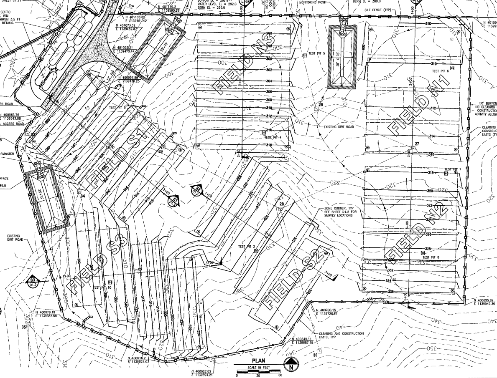

# Port numbering scheme

There are 6 fields labled S1, S2, S3, N1, N2 and N3.

There are 4 zones per field, 6 laterals per zone, and 2 end caps per lateral.

The fields are organized by elevation (each lateral must be level), so it is easy to see the 24 caps on the left of the field and the 24 caps on the right of the field, both marching up the hill. You can also see the 4 monuments and zone controllers marching up the center of the field, one for each zone.

The numbering scheme uses field name, zone number, lateral number and side (left or right), all numbered starting from 1 and continuing up the hill.

For example, **S1_Z2_L3_R** refers to "South field 1, zone 2, lateral 3, right side". It is the 9th cap on the right-hand side in the S1 field. This particular cap is broken, so it is easy to spot.

