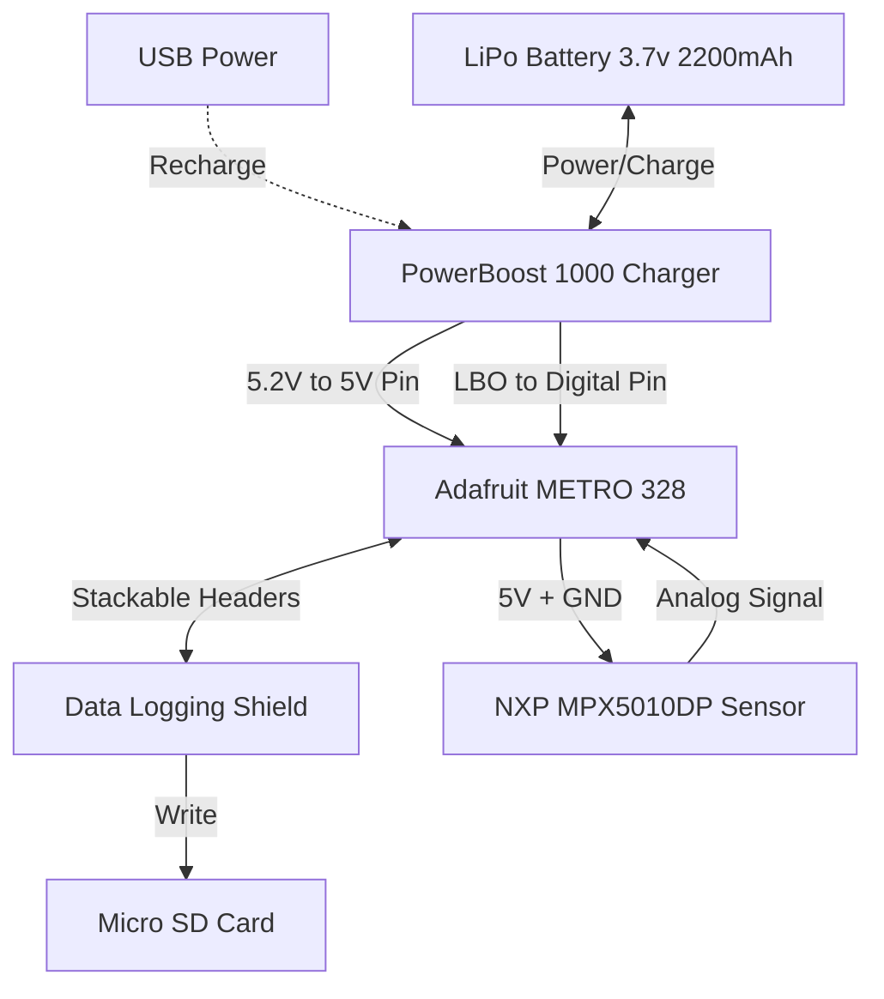

# Version 1

## Goal

Use the MPX5010DP sensor to measure and log lateral pressure for 1 day.

## Parts List

| Part | Vendor | Price |
|------|--------|-------|
| MPX5010DP Pressure Sensor | [Mouser](https://www.mouser.com/ProductDetail/NXP-Semiconductors/MPX5010DP?qs=N2XN0KY4UWXY1XQyQ71Xsg%3D%3D&countryCode=US&currencyCode=USD) | $19.69 |
| Adafruit Assembled Data Logging shield for Arduino | [Adafruit](https://www.adafruit.com/product/1141) | $13.95 |
| Adafruit METRO 328 - Arduino Compatible - with Headers (ATmega328) | [Adafruit](https://www.adafruit.com/product/2488) | $17.50 |
| CR1220 12mm Diameter - 3V Lithium Coin Cell Battery (CR1220) | [Adafruit](https://www.adafruit.com/product/380) | $0.95 |
| Lithium Ion Cylindrical Battery - 3.7v 2200mAh | [Adafruit](https://www.adafruit.com/product/1781) | $9.95 |
| PowerBoost 1000 Charger - Rechargeable 5V Lipo USB Boost @ 1A - 1000C | [Adafruit](https://www.adafruit.com/product/2465) | $19.95 |
| Micro SD card and adapter | Various | $3.50 |
| On/Off switch with LED | [Adafruit](https://www.adafruit.com/product/916) | $4.95 |
| Large Plastic Project Enclosure - Weatherproof with Clear Top | [Adafruit](https://www.adafruit.com/product/905) | $19.95 |
| Soft Masterkleer PVC Tubing for Air and Water 4 mm ID, 6 mm OD, 25' | [McMaster-Carr](https://www.mcmaster.com/5233K116/) | $13.25 |
| Plastic Submersible Cord Grip PG Threads, for 0.08"-0.24" Cord OD, PG-9 Knockout Size | [McMaster-Carr](https://www.mcmaster.com/69915K112/) | $4.00 |
| Thick-Wall Plug (1-1/2" NPT)	4596K77 | [McMaster-Carr](https://www.mcmaster.com/4596K77/) | $6.52 |
| Hose Barb (5/32" ID x 1/8" NPT) | TODO | TODO |

Total: $130.64

Notes:
* The MPX5010DP sensor has a notch on pin 1 (Vout)

## Block Diagram

Notes:
* Connect the 5.2V power from the PowerBoost 1000C to the Metro 5V power pin. Do not use the 7V DC jack on the Metro.
* Recharge the battery via the PowerBoost 1000C USB port. Recharging should take 2-3 hours.
* Connect the LBO pin of the PowerBoost 1000C to a digital pin on the Metro to monitor the battery voltage. When the LBO goes to 0V, the battery is low, and the software should close all files and stop logging.

## Power Budget

### Estimated Current Consumption (at 5V)
* **Active Mode (Reading & writing to SD card, ~100ms duration):**
  * Adafruit METRO 328: ~20mA
  * MPX5010DP Sensor: ~7mA
  * Micro SD Card (Write state): ~100mA
  * PowerBoost 1000C Quiescent: ~5mA
  * **Total Active Current:** ~132mA

* **Sleep Mode (Between readings):**
  * Adafruit METRO 328 (LowPower sleep but Power LED & USB IC remain active): ~15mA
  * MPX5010DP Sensor (Always powered on): ~7mA
  * Micro SD Card (Idle state): ~1mA
  * PowerBoost 1000C Quiescent: ~5mA
  * **Total Sleep Current:** ~28mA

*Note: The stock Metro 328 has an always-on power LED and USB converter.*

*Idea 1: Add a transistor to cut power to the sensor during sleep.*

*Idea 2: A standard Arduino digital pin can easily power the sensor (pins supply up to 20mA max continuous). Route the sensor's power to a digital pin, set it HIGH 20ms before taking a reading, and set it LOW right before going to sleep.*

### Battery Capacity Equivalency
* 3.7V 2200mAh battery = 8.14 Wh
* Assuming 85% boost conversion efficiency = 6.92 Wh available at 5V
* Equivalent to roughly **1384 mAh at 5V**.

## Battery Life Estimates

Due to our hardware constraints, the sleep current (~28mA) represents the majority of our energy expenditure.

**Scenario 1: Logging every 5 seconds**
* Average Current = `(132mA * 0.1s + 28mA * 4.9s) / 5s` = **~30.1 mA**
* Expected Battery Life = `1384 mAh / 30.1 mA` = **~46.0 hours (1.9 days)**

**Scenario 2: Logging every 20 seconds**
* Average Current = `(132mA * 0.1s + 28mA * 19.9s) / 20s` = **~28.5 mA**
* Expected Battery Life = `1384 mAh / 28.5 mA` = **~48.5 hours (2.0 days)**

**Scenario 3: Logging every 60 seconds**
* Average Current = `(132mA * 0.1s + 28mA * 59.9s) / 60s` = **~28.2 mA**
* Expected Battery Life = `1384 mAh / 28.2 mA` = **~49.1 hours (2.0 days)**

**Conclusion:** Because the system cannot completely eliminate phantom/idle current, changing the logging interval from 5 seconds to 60 seconds only achieves an extra 3 hours of battery life. However, even under the worst-case scenario (every 5 seconds), the battery handles the primary goal of 1-day operation gracefully.

## Low Battery Monitoring

The code monitors the LBO pin of the PowerBoost 1000C; when there is a low battery state, it closes the file and sleeps forever. This is probably as good as we can do in software, but it still risks damaging the battery if the logger is left for days or weeks.

*Idea: Build a power latching circuit to cut power to the entire system when the battery is low. This should protect the battery over long periods of time. Additional parts: P-channel MOSFET, NPN transistor, resistors.*