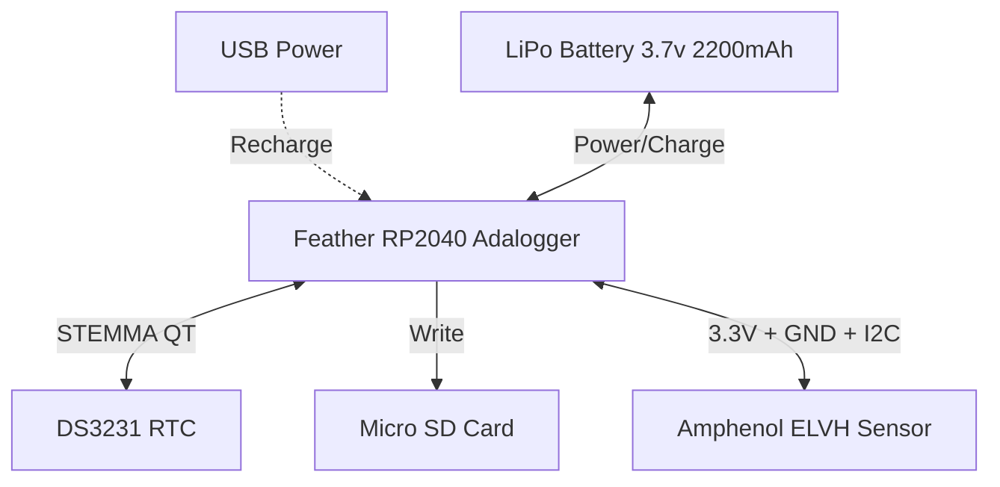

# Version 1

## Goal

Increase battery life compared to the v1 design.

Key decisions:
* Use the 3.3V Adafruit Feather RP2040 Adalogger instead of the 5V Adafruit METRO 328 and data logging shield
* Use the 3.3V Amphenol ELVH-M100G-HANH-C-N2A4 digital pressure sensor instead of the 5V MPX5010DP

## Parts List

| Part | Vendor | Price |
|------|--------|-------|
| Amphenol ELVH-M100G-HANH-C-N2A4 Pressure Sensor | [DigiKey](https://www.digikey.com/en/products/detail/amphenol-all-sensors-corporation/ELVH-M100G-HANH-C-N2A4/13697202) | $39.03 |
| Adafruit Feather RP2040 Adalogger | [Adafruit](https://www.adafruit.com/product/5980) | $14.95 |
| Adafruit DS3231 Precision RTC | [Adafruit](https://www.adafruit.com/product/5188) | $13.95 |
| STEMMA QT / Qwiic JST SH 4-Pin Cable - 50mm Long | [Adafruit](https://www.adafruit.com/product/4399) | $0.95 |
| CR1220 12mm Diameter - 3V Lithium Coin Cell Battery (CR1220) | [Adafruit](https://www.adafruit.com/product/380) | $0.95 |
| Lithium Ion Cylindrical Battery - 3.7v 2200mAh | [Adafruit](https://www.adafruit.com/product/1781) | $9.95 |
| 64MB Micro SD Card | [Adafruit](https://www.adafruit.com/product/5249) | $3.50 |
| On/Off switch with LED | [Adafruit](https://www.adafruit.com/product/916) | $4.95 |
| Small Plastic Project Enclosure - Weatherproof with Clear Top | [Adafruit](https://www.adafruit.com/product/903) | $9.95 |
| Soft Masterkleer PVC Tubing for Air and Water 4 mm ID, 6 mm OD, 25' | [McMaster-Carr](https://www.mcmaster.com/5233K116/) | $13.25 |
| Plastic Submersible Cord Grip PG Threads, for 0.08"-0.24" Cord OD, PG-9 Knockout Size | [McMaster-Carr](https://www.mcmaster.com/69915K112/) | $4.00 |
| Thick-Wall Plug (1-1/2" NPT)	4596K77 | [McMaster-Carr](https://www.mcmaster.com/4596K77/) | $6.52 |
| Hose Barb (5/32" ID x 1/8" NPT) | TODO | TODO |

Total: $121.96

## Block Diagram

Notes:
* The Feather RP2040 Adalogger includes a built-in LiPo charging circuit and a Micro SD card slot, eliminating the need for a separate PowerBoost and Data Logging shield.
* Recharging the battery is done simply by plugging the Feather into USB.
* Communication with the Amphenol ELVH sensor and the DS3231 RTC is done over I2C.

## Power Budget

### Estimated Current Consumption (at 3.3V)
* **Active Mode (Reading & writing to SD card, ~100ms duration):**
  * Adafruit Feather RP2040 Adalogger: ~25mA
  * Amphenol ELVH Sensor: ~3mA
  * Adafruit DS3231 RTC: ~1mA
  * Micro SD Card (Write state): ~100mA
  * **Total Active Current:** ~129mA

* **Sleep Mode (Between readings):**
  * Adafruit Feather RP2040 Adalogger (Dormant mode + Regulator quiescent): ~2mA
  * Amphenol ELVH Sensor (Standby): ~0.1mA
  * Adafruit DS3231 RTC: ~0.2mA
  * Micro SD Card (Idle state): ~1mA
  * **Total Sleep Current:** ~3.3mA

*(Note: The Feather RP2040's linear regulator and USB circuitry have some quiescent current, but overall sleep consumption is vastly lower than the previous METRO 328 + PowerBoost design).*

### Battery Capacity Equivalency
* 3.7V 2200mAh battery = 8.14 Wh
* The Feather uses a linear regulator to drop 3.7V-4.2V down to 3.3V. Current capacity is effectively conserved through a linear regulator (excluding a small quiescent ground current).
* Equivalent to roughly **2200 mAh capacity**.

## Battery Life Estimates

Due to our hardware improvements, the sleep current (~3.3mA) is significantly reduced, dramatically improving the expected battery life.

**Scenario 1: Logging every 5 seconds**
* Average Current = `(129mA * 0.1s + 3.3mA * 4.9s) / 5s` = **~5.8 mA**
* Expected Battery Life = `2200 mAh / 5.8 mA` = **~379 hours (15.8 days)**

**Scenario 2: Logging every 20 seconds**
* Average Current = `(129mA * 0.1s + 3.3mA * 19.9s) / 20s` = **~3.9 mA**
* Expected Battery Life = `2200 mAh / 3.9 mA` = **~564 hours (23.5 days)**

**Scenario 3: Logging every 60 seconds**
* Average Current = `(129mA * 0.1s + 3.3mA * 59.9s) / 60s` = **~3.5 mA**
* Expected Battery Life = `2200 mAh / 3.5 mA` = **~628 hours (26.2 days)**

**Conclusion:** The transition to the 3.3V RP2040 architecture and the removal of the PowerBoost dramatically reduces idle power consumption. The new design vastly exceeds the 1-day operation goal, allowing for multi-week deployments on a single charge.