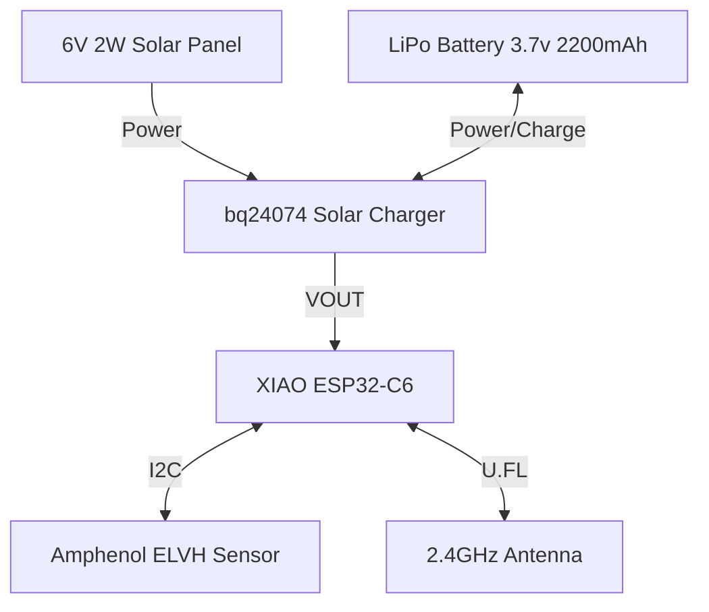
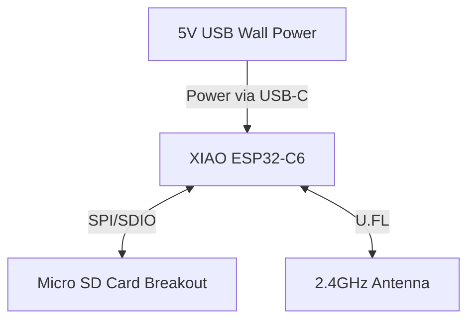

# Version 3

## Goal

Create a distributed, long-range pressure logging system with multiple autonomous sensor nodes and a centralized base station. The system will operate indefinitely using solar power at the sensor nodes.

Key decisions:
* Split the architecture into two node types: Sensor Nodes (up to 24) and a Base Station.
* Use the Seeed Studio XIAO ESP32-C6 with an external antenna for all nodes, communicating via ESP-NOW LR (Long-Range).
* Sensor nodes will be solar-powered for perpetual operation, waking up to take readings and transmit data.
* Base station will act as the coordinator, assigning sleep times to avoid collisions, logging data to an SD card, and being continuously powered.

## System Architecture

The typical operation cycle for a sensor node is:
1. Wake up from deep sleep.
2. Read pressure data from the Amphenol sensor.
3. Transmit data to the Base Station via ESP-NOW LR.
4. Wait for an acknowledgment and a "time-to-sleep" value from the Base Station.
5. Enter deep sleep for the specified duration.

The Base Station manages the 24 sensor nodes by handing out synchronized time slots, ensuring that data is collected every 5 seconds per node without RF collisions.

## Parts List

### Sensor Node (Per Node)

| Part | Vendor | Price |
|------|--------|-------|
| Seeed Studio XIAO ESP32-C6 | [Seeed Studio](https://www.seeedstudio.com/Seeed-Studio-XIAO-ESP32C6-p-5884.html) | $5.20 |
| 2.4GHz Dipole Swivel Antenna with RP-SMA - 5dBi | [Adafruit](https://www.adafruit.com/product/945) | $5.95 |
| RP-SMA to uFL/u.FL/IPX/IPEX RF Adapter Cable | [Adafruit](https://www.adafruit.com/product/851) | $3.95 |
| Amphenol ELVH-M100G-HANH-C-N2A4 Pressure Sensor | [DigiKey](https://www.digikey.com/en/products/detail/amphenol-all-sensors-corporation/ELVH-M100G-HANH-C-N2A4/13697202) | $39.03 |
| Lithium Ion Cylindrical Battery - 3.7v 2200mAh | [Adafruit](https://www.adafruit.com/product/1781) | $9.95 |
| 6V 2W Solar Panel - ETFE | [Adafruit](https://www.adafruit.com/product/5366) | $16.00 |
| Universal USB / DC / Solar Lithium Ion/Polymer charger - bq24074 | [Adafruit](https://www.adafruit.com/product/4755) | $14.95 |
| Small Plastic Project Enclosure - Weatherproof with Clear Top | [Adafruit](https://www.adafruit.com/product/903) | $9.95 |
| Tubing, Cord Grip, & Hardware | Various | ~$20.00 |

**Sensor Node Total: ~$124.98** *(Multiply by total number of deployed nodes)*

### Base Station

| Part | Vendor | Price |
|------|--------|-------|
| Seeed Studio XIAO ESP32-C6 | [Seeed Studio](https://www.seeedstudio.com/Seeed-Studio-XIAO-ESP32C6-p-5884.html) | $5.20 |
| 2.4GHz Dipole Swivel Antenna with RP-SMA - 5dBi | [Adafruit](https://www.adafruit.com/product/945) | $5.95 |
| RP-SMA to uFL/u.FL/IPX/IPEX RF Adapter Cable | [Adafruit](https://www.adafruit.com/product/851) | $3.95 |
| Micro SD SPI or SDIO Card Breakout Board - 3V ONLY! | [Adafruit](https://www.adafruit.com/product/4682) | $3.50 |
| Micro SD Card | [Adafruit](https://www.adafruit.com/product/5249) | $3.50 |
| 5V 1A (5W) USB power supply | Various | $5.95 |
| Weatherproof Project Enclosure | [Adafruit](https://www.adafruit.com/product/903) | $9.95 |

**Base Station Total: ~$38.00**

## Block Diagrams

### Sensor Node

### Base Station

## Power Budget

### Sensor Node Power Budget
* **Active Mode (Waking, reading, TX/RX via ESP-NOW LR, ~100ms duration):**
  * XIAO ESP32-C6 (TX/RX Peak): ~250mA
  * Amphenol ELVH Sensor (Active): ~3.1mA
  * **Total Active Current:** ~253.1mA
* **Sleep Mode (Between readings):**
  * XIAO ESP32-C6 (Deep Sleep): ~0.03mA (30µA)
  * Amphenol ELVH Sensor (Standby): ~0.1mA (100µA)
  * **Total Sleep Current:** ~0.13mA (130µA)

**Energy Consumption (Logging every 5 seconds):**
* Average Current = `(253.1mA * 0.1s + 0.13mA * 4.9s) / 5s` = **~5.19 mA**
* Daily Power Consumed = `5.19 mA * 24 hours` = **~124.6 mAh / day**

**Solar Panel & Battery Sizing:**
* **Solar Production:** The 6V 2W solar panel produces approximately 330 mA in direct sunlight. With a conservative estimate of 4 hours of equivalent full sunlight per day, it generates `330 mA * 4h = 1320 mAh / day`. This is over 10x the daily required energy, meaning it can easily maintain a full charge and replenish the battery even on partially cloudy days.
* **Battery Capacity:** The 3.7V 2200mAh LiPo battery acts as a significant buffer. With a daily consumption of ~125 mAh, a fully charged 2200mAh battery provides about **17.6 days of reserve power** operating in complete darkness or persistent cloud cover.

**Conclusion:** The sensor node is perpetually sustainable. The moderately sized 2W solar panel combined with the robust 2200mAh battery allows the system to easily weather multi-week periods of poor conditions.

### Base Station Power Budget
* **Operating State (Always Active Coordinator):**
  * XIAO ESP32-C6 (Active ESP-NOW Rx/Tx): ~100mA continuous.
  * Micro SD Card (Intermittent Write): ~100mA peak.
  * **Total Peak Current:** ~200mA
* **Power Supply Sizing:**
  * Since the base station is centrally powered, a standard 5V 1A (1000mA) USB wall adapter provides 5x the peak required current, offering a massive comfort margin and leaving plenty of overhead for the eventual integration of an LTE cloud module.

## No Solar Option

Dropping the solar panel and charger reduces the cost of each sensor node by $30.95.

Each sensor node can go `2200 mAh / 5.19 mA = 423 hours = 17.6 days` on battery alone.

## Possible Adafruit WF100DPZ Breakout Board

[Is Adafruit about to launch a new ported pressure sensor board?](https://blog.adafruit.com/2026/03/11/finding-a-low-cost-ported-pressure-sensor-the-wf100dpz/) If there is an option for the `WF100DPZ 0.1BG S6 DT` sensor, the per-node cost might drop by $10-20.